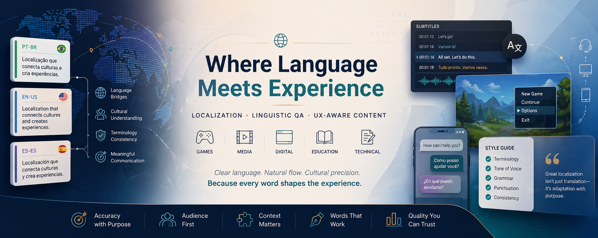

# 📄 Translation, Editing & Localization Portfolio

**Marllos Paiva Prado — Brazilian Portuguese ↔ English**  
**Localization Editor | Linguistic QA | UX-Aware Content Specialist**

  

A curated portfolio showcasing localization, multilingual communication, and editorial quality across gaming, multimedia, and technical content.

 

---

## 🚀 Start Here

 

### 🦠 **Dangers of the Internet — Freelance Narrative Localization**

Freelance localization project for a Brazilian startup involving dialogue-driven educational game content (pt-BR → en-US), focused on character voice, humor adaptation, and terminology consistency.  
🔗 https://github.com/pradoprojects/dangers-of-the-internet-localization

 

### 🎧 **Catch the Cup — Multilingual UX Through Music**

Multimedia localization case study exploring subtitle timing, multilingual pacing, and emotional flow across three coordinated tracks.  
🔗 https://github.com/pradoprojects/catch-the-cup-localization

 

### 📕 **Pokémon Center — Strategic Localization & UX Study**

PT-BR localization strategy focused on terminology governance, usability clarity, and UX-informed editing.  
🔗 https://github.com/pradoprojects/pokemon-center-ptbr

 

### 🏹 **The Hunting Game — Human-Centered Technical Writing**

Published English-language writing sample using metaphor and structured communication to make complex technical topics more accessible. Relevant to UX writing, localization clarity, and editorial strategy.  
🔗 https://github.com/pradoprojects/Translation_QA_Projects/tree/main/Docs/ISSRE2015/Readme.md

 

### 🎬 **Zapan — Viral Video Localization (PT-BR → EN-US)**

Comedic localization case study focused on timing, phonetic preservation, and subtitle readability.  
🔗 https://github.com/pradoprojects/Translation_QA_Projects/tree/main/subtitling-zapan-viral

 

---

## 📚 Additional Work Samples

 

## 🕹 Gaming Localization

### 📗 **MegaMan 11 — Intro Scene**

**Role:** Translation  
Independent sample translating the intro scene for *MegaMan 11*.

🔗 https://github.com/pradoprojects/Translation_QA_Projects/tree/main/Translations/MegaMan11

 

### 📗 **Bakeru — Menu Options**

**Role:** Translation  
Independent sample translating menu options for *Bakeru*.

🔗 https://github.com/pradoprojects/Translation_QA_Projects/tree/main/Translations/Bakeru

 

### 📗 **Sonic Superstars — Menu Localization**

**Role:** Localization  
Independent sample localizing menu options from pt-PT into pt-BR.

🔗 https://github.com/pradoprojects/Translation_QA_Projects/tree/main/Translations/Sonic

 

---

## 🔬 Technical Writing & Research

Selected writing and research samples demonstrating structured communication, analytical rigor, and documentation quality.

### 📘 **Main Publication**

🔗 https://github.com/pradoprojects/Translation_QA_Projects/tree/main/Docs/Main-publication-JSS-2018.pdf

Additional publications available in the Docs folder.

🔗 https://github.com/pradoprojects/Translation_QA_Projects/tree/main/Docs

 

---

## 📝 Review & Quality Evaluation Samples

Examples of structured review, feedback, and quality assessment.

* CibSE 2017 @ ICSE  
* CBSoft 2016  
* SBES 2016 — Technical Research  
* TSA 2016 Review Request  
* ESEM 2014 Review Request

🔗 https://github.com/pradoprojects/Translation_QA_Projects/tree/main/Paper_Reviews

 

---

## 🧰 Tools

MemoQ • MateCat  
Subtitle Edit  
Microsoft Word • Google Docs  
Canva • Figma  
LaTeX • Overleaf  
GitHub  
PDF Annotation Tools  
Terminology Management Workflows

 

---

## 🎯 Value for Localization Teams

✔ Real portfolio samples with verifiable deliverables  
✔ Localization strategy beyond direct translation  
✔ Strong PT-BR / English cross-cultural communication  
✔ Subtitle timing and multilingual audiovisual workflows  
✔ Structured review and editorial quality mindset  
✔ UX-aware language adaptation for digital products  
✔ Clear communication of complex ideas

 

---

## 📎 Credentials

🌐 ProZ Profile  
https://www.proz.com/profile/4523581

 

📜 Translation & Localization Mentorship Certificate  
https://app.box.com/s/x4sbdk6dmzfa5nhlagvimefmc3fvroy0

 

---

## 📫 Contact

**Marllos Paiva Prado**  
📧 [marllospaiva@gmail.com](mailto:marllospaiva@gmail.com)  
🔗 https://www.linkedin.com/in/marllos-p-a383641b2
